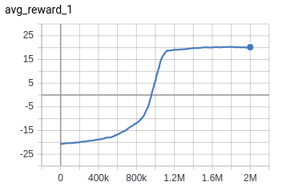
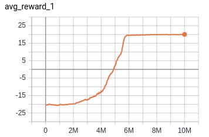

DQN-A2C in Tensorflow
===============

Tensorflow implementation of Deep Reinforcement Learning algorithms: DQN & A2C:  

[1] [(DQN) Human-level control through deep reinforcement learning ](https://www.nature.com/articles/nature14236)  
[2] [(A2C) Asynchronous Methods for Deep Reinforcement Learning ](https://arxiv.org/abs/1602.01783)

## Requirements
1. python 3.7
2. tensorflow 1.14
3. gym

## Usage
First, install prerequisites:

`python setup.py install`

Train Pong with DQN model

`python main.py --env PongNoFrameskip-v4 --agent_type dqn --total_timesteps 2000000`

Train Poing with A2C model

`python main.py --env PongNoFrameskip-v4 --agent_type a2c --total_timesteps 10000000`

## Results

Results of `PongNoFrameskip-v4` in DQN, A2C

### DQN

### A2C

